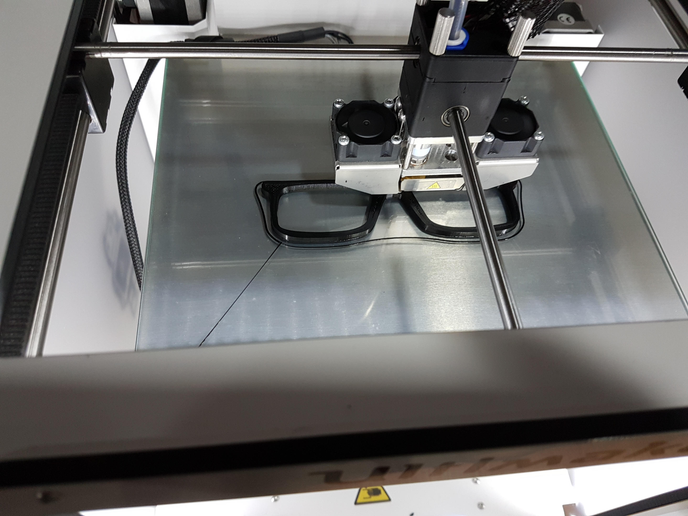

## 3D PRINTER
 **I**n my 3rd day of fablab works i learned more things about the 3D printer .As it is already explained it is a CNC machine itself. We can develop any solid structures through the 3D printer. All the things we have know that is to create the *3D design* of the structure. For the development 3D structuters we can use any kind of 3D designing softwares.
 
 ### Commonly used Softwares for 3D design are
 1.Rhinoceros
 
 2.Solid works
 
 3.Catia
 
 4.AutoCad
 
 
  After the designing of the 3D structures we have to save the file in **.stl** format. stl means that stereolithography file format used for the 3D structue designing.
        
 3D printer reads only G-codes so that we have to convert the **.stl** format file into **.gcode** format. For the conversion we can use any softwares which converts the files into **.gcode** format. Here our 3D printer is **ULTIMAKER 2+**. it has it's own customized software called **CURA** for the conversion of 3D structures into .gcode format.
        

### Here i am sharing my first 3D printing Experiences...

## 3D Printed SPECTACLES FRAME 

For the designing of the spectacles frame i used **Rhinoceros 5** as the designing software.Initially i designed the **Frame front** of the spectacles frame with the required dimensions.

Top view of the design is,

Perspective view of the design is,

After creating the 3D design of the frame front, we have to save the file as **.stl**  format.

The next step is to creating its gcode of the 3D design. For that am using **CURA** software. Open the **.stl** file using cura there we can se the 3D design of the structure we developed. In CURA we can do alot of functions such as scaling, moving etc...

For most of the 3D structures we need supprort structures also , in CURA there is a seperate option for building support structures. support structures are thin unwanted structures which can be easily removed.In cura we have to select the nozzle and material using also.

**My design for front frame in CURA ...***

   Next step is to create the code for that save the file from CURA it will be in the **.gcode** format.
   
   Then save the **.gcode** file in the Removable Disk of the 3D printer.Start printing. 

**Here is the Front frame of the Spectacles**

**N**ext is to develop the Temples(long arms) of the frame 

For that i designed the temples in the same software that i designed the front frame.

Then the design is saved as **.stl** format and changed  to **.gcode** in CURA.

