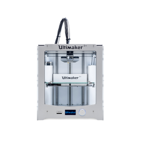
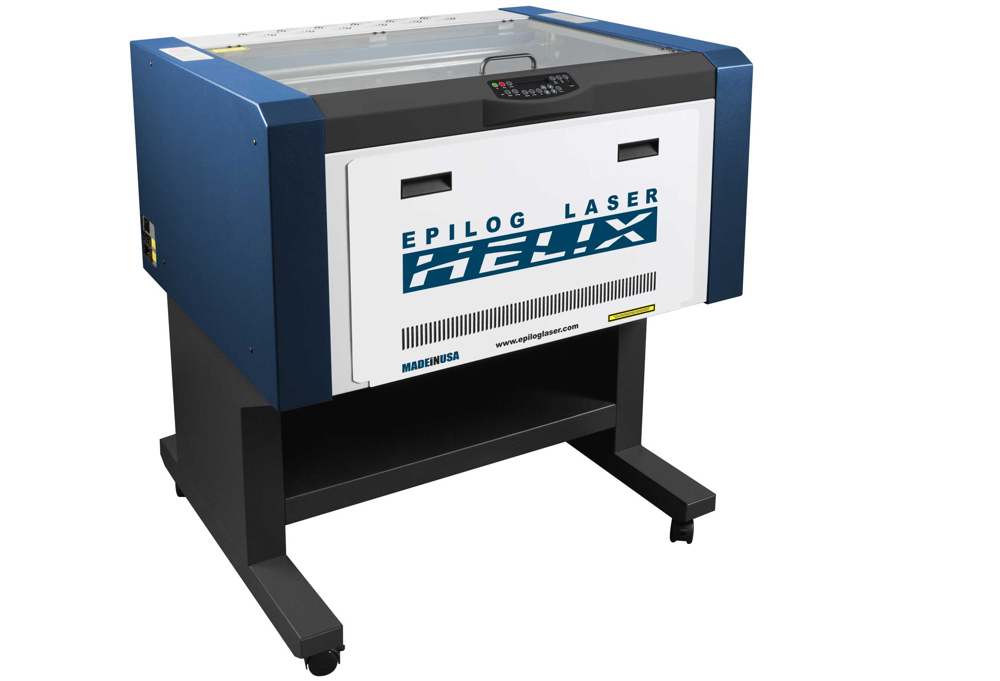
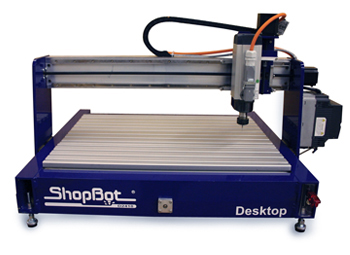

## **FAB LAB WORKSHOP**
### SYLLABUS TO BE COVERED IN THE PROGRAM
Day 1 : Introduction to Fablab 

Day 2 : Github Pages and Documentation

Day 3 : 3D Printing
                                
Day 4 : Laser Cutting,Moulding and Casting
                               
Day 5 : Electronics Production and CNC
                                
Day 6 : Vinyl Cutting 

Day 7 : Screen Printing

   
   
## **First day of my fab works**
**"HOW TO MAKE ALMOST ANYTHING"**

**_Exploring the new Ideas_**
  

**What is CNC**

Computer numerical control (CNC) is the automation of machine tools by means of computers executing pre-programmed sequences of machine control commands. This is in contrast to machines that are manually controlled by hand wheels or levers, or mechanically automated by cams alone.

## **Second day of my fab works**

In my second day of fab workshop, got an idea about how to create a github page and document the important things in it.we had a great session about the documentation process.Each and every stages of the page creation and documentation are well explained.

## **Third day of my fab works**

## 3D Printer
 

What is a 3D printer?
It is a machine allowing the creation of a physical object from a three-dimensional digital model, typically by laying down many thin layers of a material in succession.
3D printing, also known as additive manufacturing (AM), refers to processes used to create a three-dimensional object in which layers of material are formed under computer control to create an object. Objects can be of almost any shape or geometry and are produced using digital model data from a 3D model or another electronic data source such as an Additive Manufacturing File (AMF) file. STL is one of the most common file types that 3D printers can read. Thus, unlike material removed from a stock in the conventional machining process, 3D printing or AM builds a three-dimensional object from computer-aided design (CAD) model or AMF file by successively adding material layer by layer.

 - ## [DAY-3   MY 3D Printing Experiences](https://navaska.github.io/DAY3-3DPrintingExperiences)
 
## **Fourth day of my fab works**
## LASER CUTTER

**Laser cutting** is a technology that uses a laser to cut materials, and is typically used for industrial manufacturing applications, but is also starting to be used by schools, small businesses, and hobbyists. Laser cutting works by directing the output of a high-power laser most commonly through optics. The laser optics and CNC (computer numerical control) are used to direct the material or the laser beam generated. A typical commercial laser for cutting materials would involve a motion control system to follow a CNC or G-code of the pattern to be cut onto the material. The focused laser beam is directed at the material, which then either melts, burns, vaporizes away, or is blown away by a jet of gas,[1] leaving an edge with a high-quality surface finish. Industrial laser cutters are used to cut flat-sheet material as well as structural and piping materials.
   
- ## [DAY-4   MY LASER CUTTING Experiences](https://navaska.github.io/lasercutting)

## **Fifth day of my fab works**
## ELECTRONICS PRODUCTION

In Elctronics section PCB milling using a CNC machine called **shopbot** was done.

- ## [DAY-5  MY ELECTRONICS PRODUCTION Experiences](https://navaska.github.io/electronics) 
 
## **Sixth day of my fab works**
## VINYL CUTTING
 

A vinyl cutter (or vinyl plotter) is a computer-controlled plotting device with a blade instead of a pen. A vector based design is created in a software program (usually Adobe Illustrator or Corel Draw) and then sent to the cutter where it cuts along the vector paths laid out in the design. The cutter is capable of moving the blade on an X and Y axis over the material, cutting it into any shape imaginable. Since the vinyl material comes in long rolls, projects with significant length like banners or billboards can be easily cut as well. The one major limitation with vinyl cutters is that they can only cut shapes from solid colors of vinyl. A design with multiple colors must have each color cut separately and then layered on top of each other as it is applied to the substrate. Also, since the shapes are cut out of solid colors, photographs and gradients cannot be reproduced with a standalone cutter.

- ## [DAY-6   MY VINYL CUTTING Experiences](https://navaska.github.io/vinylcutting)

### _ABOUT ME_
### NAVAS K A
Doing B.Tech in Electronics and Communication Engineering at MESCE,KUTTIPURAM

8129870302
## [Follow me on Facebook](https://www.facebook.com/ka.navas.5)
