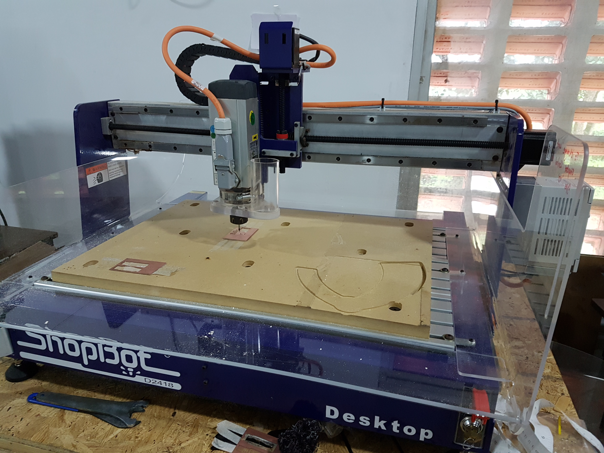

## ELECTRONICS
 
 In the Electronics section I learned about the PCB milling using Shopbot Machine.Shopbot is also a CNC machine.and after that soledring the PCB.
 
 For PCB MILLING we have to design a PCB first using any PCB designing software. Then we have to develop the CUT part and TRACE part of the PCB.
 
 Using Fabmodules.org we can generate **gcode** for the shopbot.
 
 Initially we have to set X,Y,Z axis of the Shopbot machine.After that using shopbot software by providing the required measurements we can easily mill the PCB.
 
 **PCB MILLING using shopbot**
 
 
 
 
 
 
 
 
 
