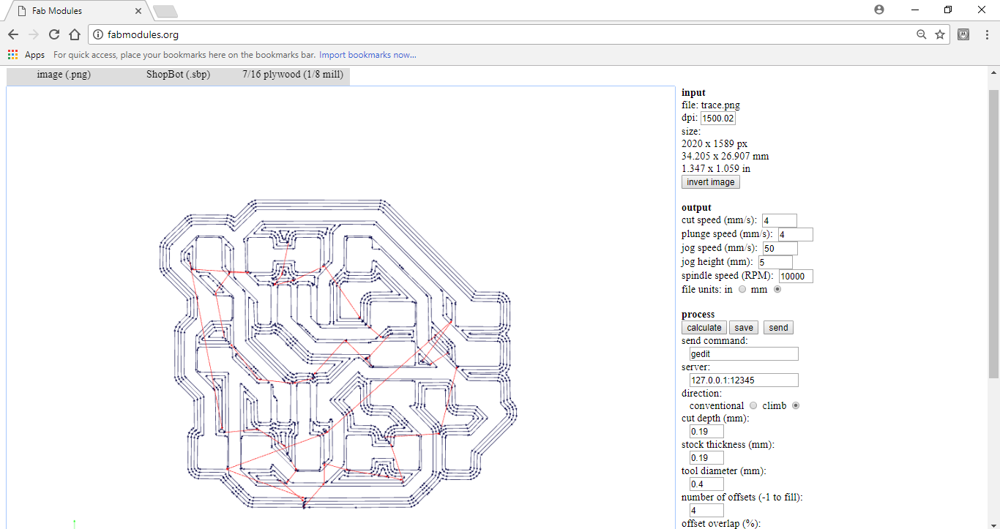

## ELECTRONICS

 In the Electronics section I learned about the PCB milling using Shopbot Machine.Shopbot is also a CNC machine,using that we can mill the PCB we required. After that soldered the PCB using the components.
 
 For PCB MILLING we have to design a PCB first using any PCB designing software.
 
 Most commonly used software for developing the desighn are 
 
 1.EAGLE
 
 2.PROTEUS
 
 By using these softwares we have to develop the **TRACE** part and **CUT** part.
 
 In **trace** part the Required cnnections are done, and  **cut** part is to cut the required PCB part from the whole copper plate. 
 
 As I already told that **SHOPBOT** is also a **CNC** machine ,so it needs gcode to work. for that we have convert the **TRACE** and **CUT** part into **gcode**. There is no specialised softwre is available for that. so we have to use online services provided by the fablab.
 
 Using [**www.Fabmodules.org**](http://fabmodules.org/) we can generate **.gcode** for the PCB milling using shopbot.
 
 ### HOW TO USE SHOPBOT
 
First we have turn ON the shopbot device and there is a safety key also present near to the power button , it should have to be in ON state.

Then open Shopbot software in the desktop. In the application we can see **X,Y,Z** axis measurements.Initially we have to set X,Y,Z axis to zero of  the Shopbot machine.

Then provide the **.gcode** file in the cut part option in the shopbot application. Then start the milling operation. 

 **PCB MILLING using shopbot**
 
 
 
 
 

## Here I am sharing my PCB milling experiences....

**LED BLINKING USING ATTINY45 MICROCONTROLLER**

Firstly i designed the circuit diagram for the device using **EAGLE** software.

**SCHEMATIC DIAGRAM**

 
By using the switch to **GENERATE/SWITCH TO BOARD** generate the **PCB** design.

From this we have to get **TRACE** part and **CUT** part.

For **TRACE PART**  select **Layer setting** and select only the **TOP** and apply.

Thus the **TRACE PART** only will display.

Then it has to exported to mage format for shopbot. For that select **File** - **Export** - **Image** Provide a name for the image file like **TRACE** ,select **MONOCHROME** and set resolution to 1500 then click **OK**.

**TRACE PART** will be exported.

Next is to export **CUT PART**. For that select **Layer setting** and select only the **DIMENSIONS** and apply.

Then it has to exported to mage format for shopbot. For that select **File** - **Export** - **Image** Provide a name for the image file like **CUT** ,select **MONOCHROME** and set resolution to 1500 then click **OK**.

Then I generated the required **gcode** For **TRACE PART** and **CUT PART** Using [**www.Fabmodules.org**](http://fabmodules.org/). 

For **TRACE PART**

By clicking the save button a **TRACE.sbp** will be downloaded.

For **CUT PART**

By clicking the save button a **CUT.sbp** will be downloaded.

Next is to use shopbot for milling purpose. Fix the copper plate on the shopbot with the help of double side tape.

Initially we have to set **X,Y,Z** axis to **ZERO** using the shopbot application.

**Initial setting has been done**

Next is to mill the **TRACE PART** in the copper plate. For trace we have to use **1/64 in** as the drill bit.Only After changing the bit we have to set zeros in the shopbot. Then provide the **TRACE.sbp** file in the cut part. and start the milling operation.

Next is to mill the **CUT PART** in the copper plate. For cut we have to use **1/32 in** as the drill bit. After changing the bit we have to set zero  in the **Z AXIS** only in shopbot. Then provide the **CUT.sbp** file in the cut part. and start the milling operation.

After this operation the required **PCB** will br ready. Then we have to solder the PCB with the required components.

### MY PCB

 
