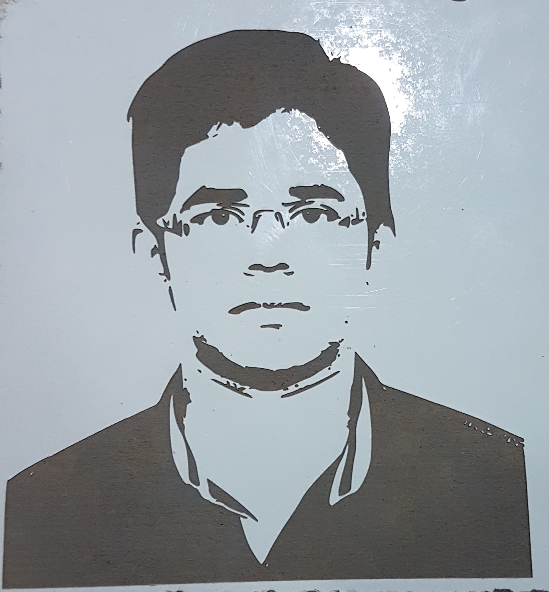

## LASER CUTTER

In the 4th day I learned about the Laser cutting machine.It is a machine cuts the materials using high beam laser. In fablab we used **EPILOG LASER** as the laser cutting machine. It is almost similar to a printer itself. That is if we want to cut any materials just click the print option  and select **EPILOG LASER** as the printer .

After choosing **EPILOG LASER** we can change the properties of the printer such as the **VECTOR ,RASTER or COMBINED** also we can change the power and speed of the laser also.

By using the mahine we can CUT or ENGRAVE the materials.

Here is  my laser engraving experience

###ENGRAVED My Photo on Cardboard

For this First I selected my photo and changed its characteristics because, for laser engraving it needs Black and white image. So i changed it to Black and white image.

For laser engraving we have to select **RASTER** and for cutting we have to select **VECTOR**

Th**ENGRAVED** image is

